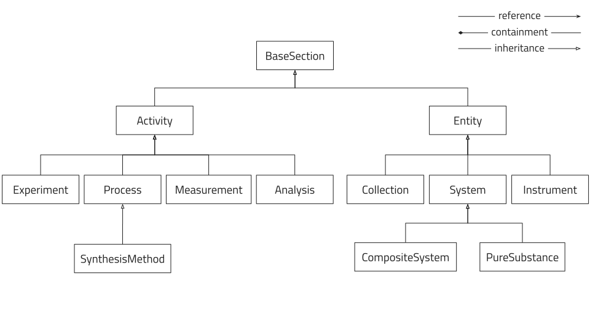

# NOMAD Data Model

NOMAD uses a bottom-up approach to data management. Instead of only supporting data in specific predefined formats, NOMAD processes files to extract data (and metadata) from an extendable variety of data formats.

This approach ensures that data are converted from heterogeneous files into homogeneous, machine-actionable structured data, making them compliant with the FAIR principles (Findable, Accessible, Interoperable, Reusable). Once the data and metadata are organized and their relationships established, it enables the creation of search interfaces, APIs, visualization, and analysis tools that can operate without dependence on specific file formats.

## Data Structure

NOMAD organizes data into **sections**, where each section can contain data and additional subsections. This hierarchical organization allows users to browse complex data similarly to browsing files and directories on a computer. Each section follows a specific definition, ensuring that all contained data and subsections have precise names, descriptions, types, shapes, and units. This structured approach not only makes it easier for users themselves to explore the data but also keeps the data and metadata consistent and interoperable, i.e., machine-readable.

## Data Model

NOMAD's data model is based on an entity-activity framework. Essentially, each section that is intended to become an entry in NOMAD is a subsection of one of the two main base sections: entities or activities. Entities are objects that persist over time, such as systems, collections, or instruments. Activities are actions involving entities, including processes, measurements, analyses, and experiments.

Sections in NOMAD are interrelated through **inheritance** and **composition**. Inheritance allows sections to inherit properties, attributes, and functions from other sections, building on predefined structures. Composition enables sections to include other sections as subsections, organizing complex data hierarchically. This flexible design makes it simple to incorporate new data types by extending and reusing existing sections.

## Base Sections

Base sections are reusable building blocks in NOMAD's data model. The top-most parent base section, `BaseSection`, provide a set of four global quantities for basic information about entries:

* `name`: A short human readable and descriptive name.

* `datetime`: The date and time associated with this section.

* `lab_id`: An ID string that is unique at least for the lab that produced this data.

* `description`: Any information that cannot be captured in the other fields.

Both the `Entity` and `Activity` base sections, inherit these four global quantities from `BaseSection`.
 

### Entity

Entities are objects that persist over time while maintaining their identity. In NOMAD, the main `Entity` section is composed of the three sections `System`, `Collection`, and `Instrument`.

- **System**: Represents any material system, from atomic to device scale. It includes properties like `elemental_composition`, which tracks the elements and their atomic fractions within the system.
- **Collection**: Used to group entities together, such as a batch of substrates.
- **Instrument**: Describes tools used for material processing or characterization.

### Activity

Activities are actions that occur over time and depend on some entity. The `Activity` section is subclassed by `Process`, `Measurement`, `Analysis`, and `Experiment` sections.

- **Process**: Represents a planned process that results in physical changes to a specified input material.
- **Measurement**: A planned process aimed at producing information about the material entity.
- **Analysis**: Involves data processing and analysis, producing output data from input data.
- **Experiment**: Groups activities together, useful for organizing multiple samples or processes under a single experimental framework.

Please note, all sections mentioned here are base sections that inherit from either `Entity` or `Activity`, which are themselves subclasses of `BaseSection`. For further details, you may refer to the NOMAD's documentation page on [How to use base sections](https://nomad-lab.eu/prod/v1/docs/howto/customization/base_sections.html). The built-in NOMAD module [`datamodel.metainfo.basesections`](https://gitlab.mpcdf.mpg.de/nomad-lab/nomad-FAIR/-/blob/develop/nomad/datamodel/metainfo/basesections.py?ref_type=heads) contains a set of base sections based on the entity-activity model. There are more base sections available for reuse that are not listed in this module.

