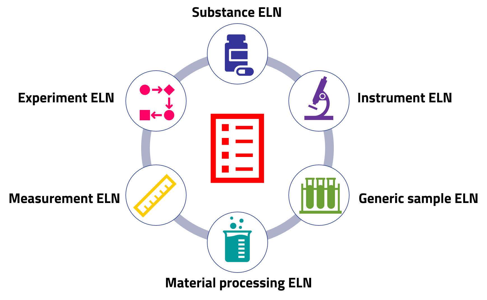
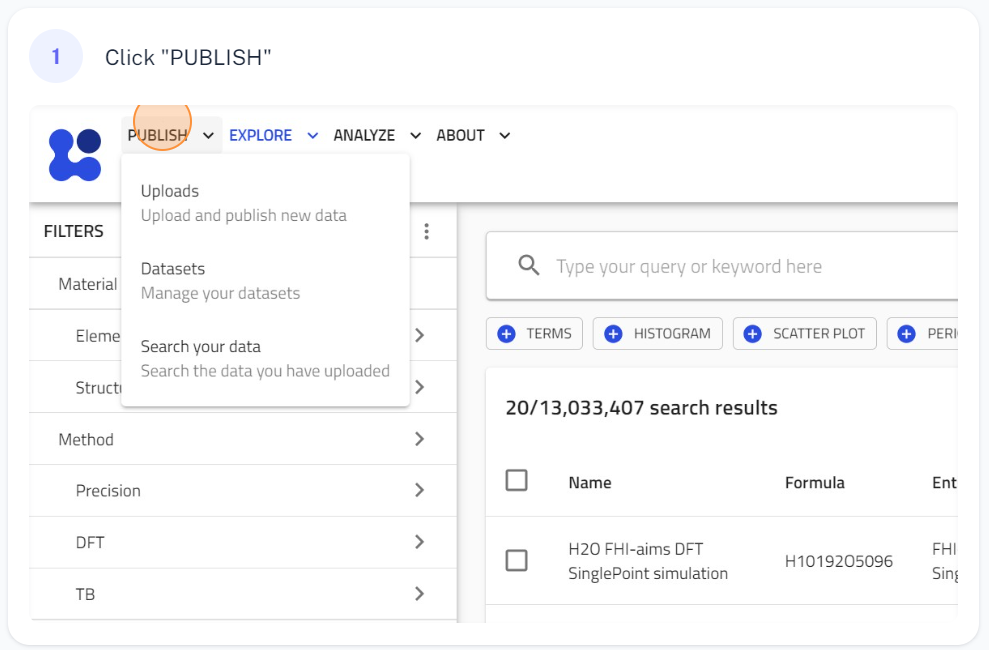
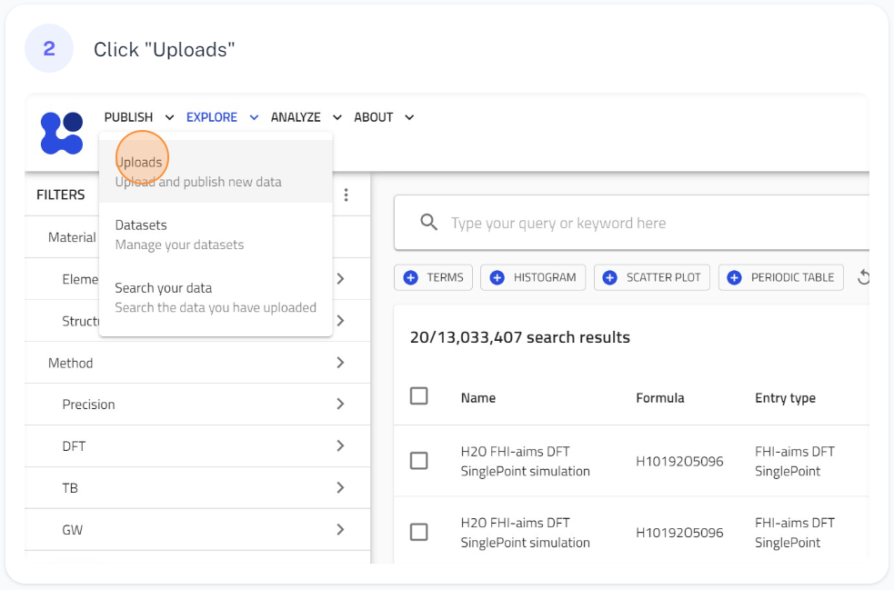
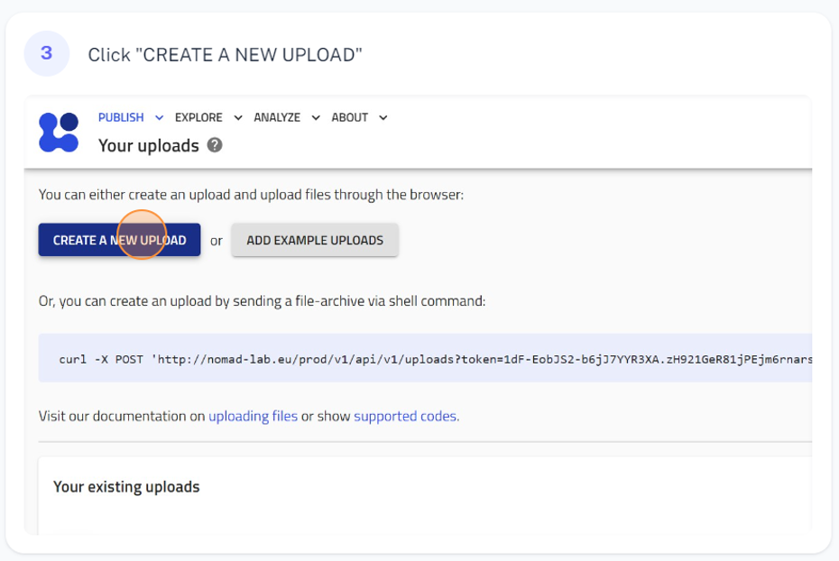
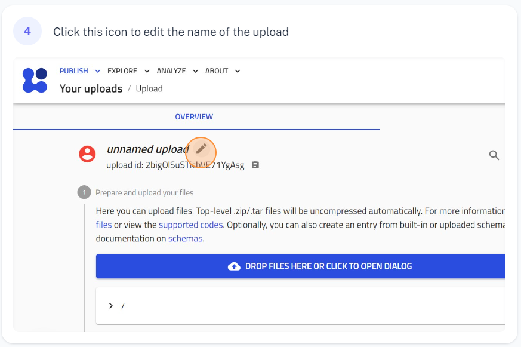
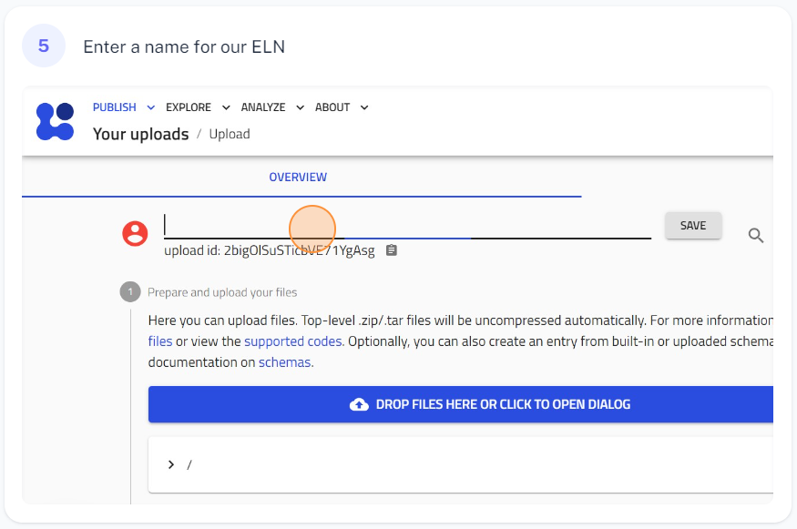
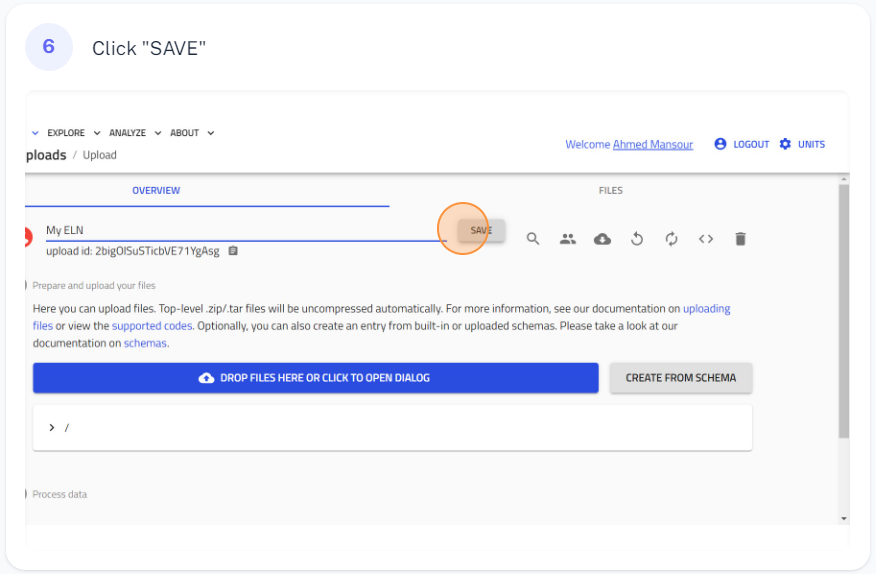
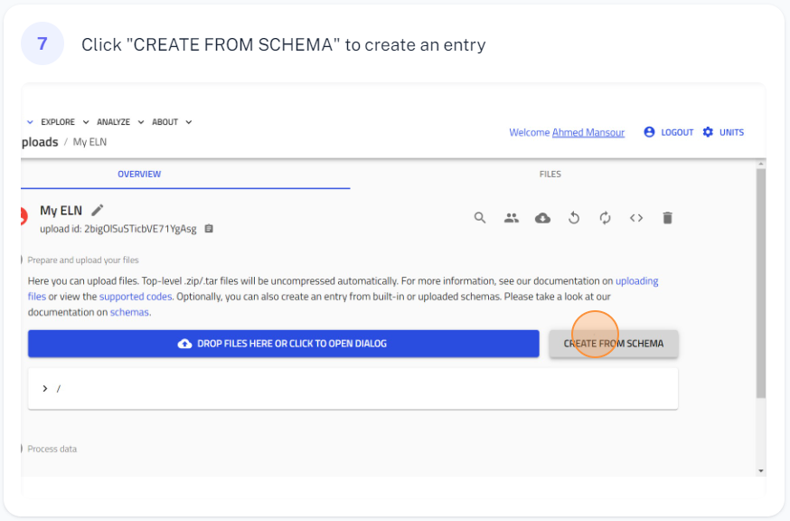
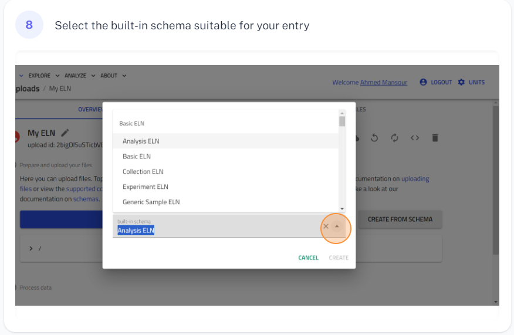
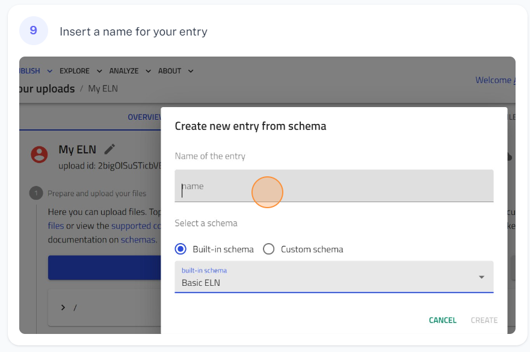

# Creating NOMAD Entries Using the ELN Built-in ELN Schemas
In this section, you will learn how to use NOMAD's built-in ELN schemas to create entries for entities and activities in your experiment.

After planning for your experiments, you would start by documenting your experimental work. This involves creating a record of all the materials and instruments that will be used during your experiment, i.e., **entities**. In addition, you should outline the conditions under which the materials will be processed and the methods of measurement, i.e., **activities**.

In NOMAD, this is done by creating entries for each entity and activity that will be used in your experiments.

### Create a New ELN Upload.

- **Step 1:**

- **Step 2:**

    
- **Step 3:**

- **Step 4:**

- **Step 5:**

- **Step 6:**

### Create an **entry** Using NOMAD's Built-in Schema.

- **Step 7:**

- **Step 8:**

- **Step 9:**

- **Step 10:**

## What is Next?
In the following sections, we will apply these general procedures to create entries for a sample ELN focused on the solution processing of organic materials. As we work through this example, we'll explore the various built-in schemas and the specific quantities they provide for "input".