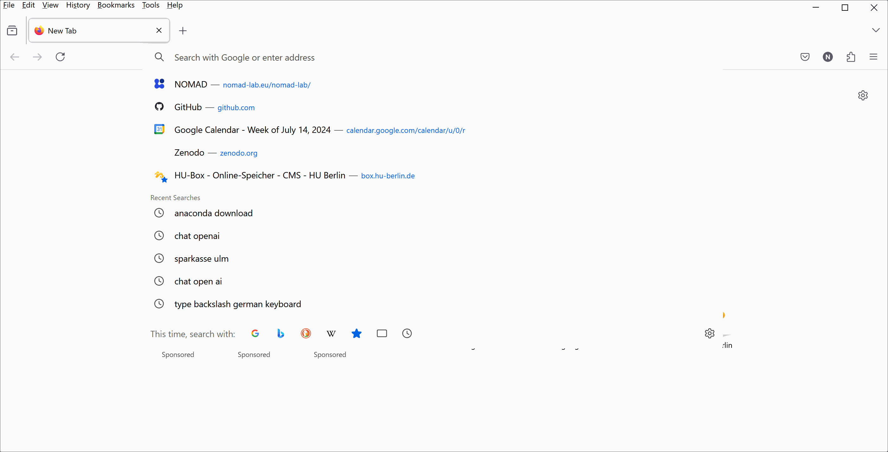

## Setting Up a Local Programming Environment

A local programming environment can include various tools depending on its purpose. To interact with NOMAD programmatically and analyze data, you would need a **Linux terminal** and **Python 3**. This setup is sufficient for the topics covered in this tutorial.

??? info "What are the main tools in a typical programming setup?"
    The purpose of the programming environment defines the specific tools to be used in the respective setup. These generally include:

    - **IDE (Integrated Development Environment)**: Tools like [Visual Studio Code (vscode)](https://code.visualstudio.com/download){:target="_blank"} or [PyCharm](https://www.jetbrains.com/pycharm/download/){:target="_blank"} to edit and manage code projects efficiently. You don't necessarily need one for this tutorial, we highly recommended to have one, like vscode.

    - **Git**: [Git](https://git-scm.com/book/en/v2/Getting-Started-Installing-Git){:target="_blank"} or another version control system for managing and tracking code changes. Installing Git on Windows also installs Git Bash by default, providing a Unix-like command-line interface suitable for this tutorial.

    - **Terminal**: A command-line interface to execute text commands. For our purposes, the default terminal on Linux and macOS works well. Windows users may prefer [WSL (Windows Subsystem for Linux)](https://learn.microsoft.com/en-us/windows/wsl/install){:target="_blank"} or [Git Bash](https://git-scm.com/downloads){:target="_blank"} to run bash commands.


### Setting Up a Linux Terminal

For Linux and macOS users, the default terminal is sufficient for this tutorial. Windows users have several options:

- **Install Git for Windows**: Installing [Git](https://git-scm.com/downloads){:target="_blank"} which also provides **Git Bash**, a Linux-like terminal. It is the fastest way and is sufficient for this tutorial.

- **Windows Subsystem for Linux (WSL)**: WSL runs a full Linux environment including its terminal on Windows. [Learn how to install WSL](https://learn.microsoft.com/en-us/windows/wsl/install){:target="_blank"}.
  
- **Separate Linux Installation**: For those interested in a dedicated Linux OS, you can install a full distribution like Ubuntu, parallel to your Windows. You can learn more about installing Ubuntu in its [official website](https://ubuntu.com/download/desktop){:target="_blank"}.


### Installing Python 3 using Anaconda

Python provides a strong toolkit for our purpose. You will mostly use the `requests` library for connecting to NOMAD. For data analysis and visualization, you will need libraries such as `NumPy` (a base N-dimensional array package), `SciPy` (for scientific computing), and `Matplotlib` (for plotting). Anaconda is a recommended Python distribution for scientific computing that brings these libraries together and simplifies setup.

Go to the [Anaconda download page](https://www.anaconda.com/download){:target="_blank"} and download the Anaconda installer for Python 3. You can skip the registration. Follow the steps provided by the installation wizard, and select the default or recommended options if you are unsure. After installation, a system reboot may be helpful. With this step completed, Python 3 and the essential libraries for data analysis and visualization are now ready for use on your system.



### Running Jupyter Notebook for Python

Open Anaconda Navigator from your applications list and launch Jupyter Notebook. This opens a browser window or tab with Jupyter's file explorer. In the Jupyter Notebook interface, navigate to your desired directory and click the **New** button in the top right corner and select 'Python 3' from the drop-down menu. This will create a new Jupyter Notebook with a Python 3 kernel. You can rename the notebook by clicking on the default title (**Untitled**). To run code, type it in a cell and press **Shift + Enter** (e.g., try `1 + 1`).
    
### Installing the `requests` Library Using Jupyter Notebook

The `requests` library, needed for making HTTP requests, is not included in the default Anaconda package. Therefore, it should be installed separately, e.g., using the `pip` package manager. It's a good practice to update `pip` frequently, e.g., before installing the `requests` library. To do this, run the following commands in a Jupyter Notebook cell: 

```python
!pip install --upgrade pip
!pip install requests
```
??? info "What is pip?"
    **[pip](https://pypi.org/project/pip/){:target="_blank"}** is a package manager specifically for Python, making it easy to install and manage Python libraries like `requests`.

    Other package managers include:
    
    - **[conda](https://docs.conda.io/){:target="_blank"}**: An alternative to pip, suitable for Python and other data science packages.
    - **[Homebrew](https://brew.sh/){:target="_blank"}**: Primarily for macOS and Linux, simplifies installing software not included in the OS.
    - **[apt](https://wiki.debian.org/Apt){:target="_blank"}**: The default package manager for Debian-based Linux systems, mainly used for system-level packages.


 


